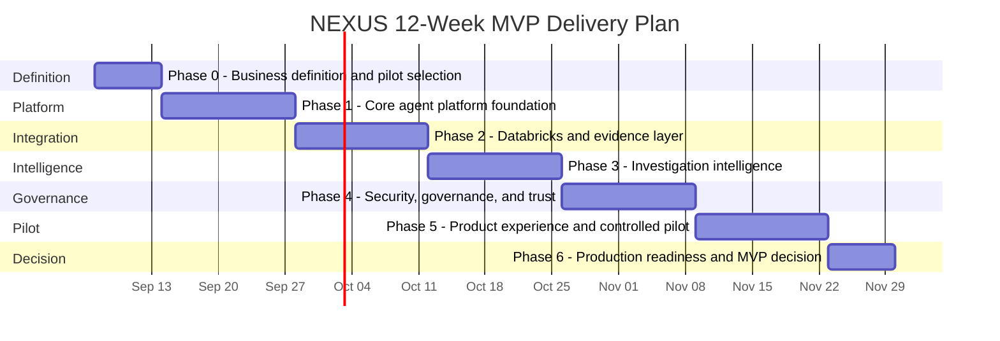
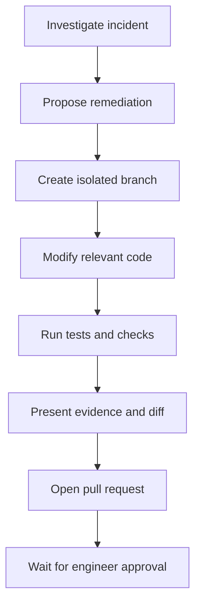
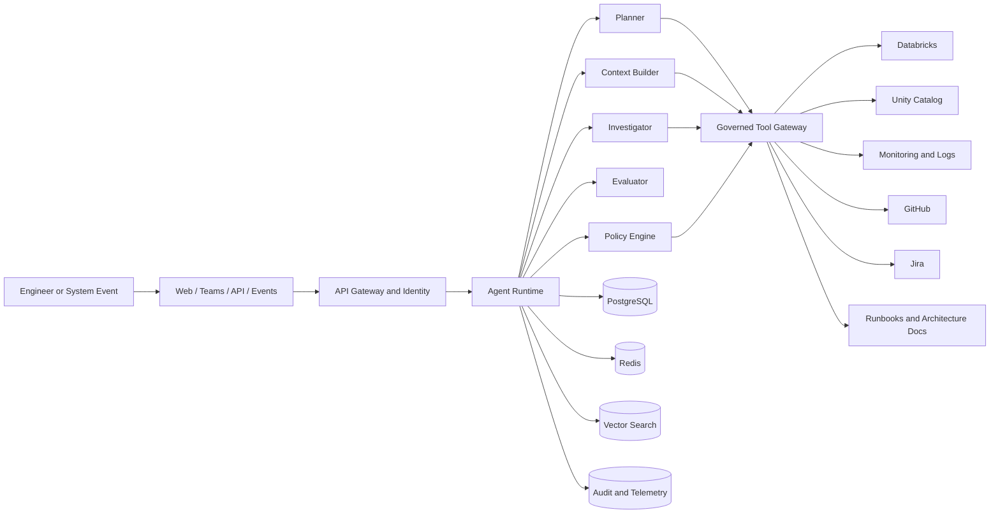

# NEXUS Project Phases and Delivery Plan

> **Product:** NEXUS - AI Data Reliability and Engineering Agent  
> **Document type:** Business delivery roadmap and phase plan  
> **Version:** 1.0  
> **Date:** September 5, 2026  
> **Status:** Proposed for stakeholder review  
> **Initial platform focus:** Databricks-first, platform-independent architecture

---

## 1. Executive Summary

NEXUS is an enterprise AI agent platform designed to help data engineering teams investigate pipeline failures, correlate operational evidence, identify likely root causes, recommend remediation, and eventually execute approved engineering actions.

The project will be delivered through **gated product increments** rather than as one large AI implementation. Each phase must produce a usable business or technical outcome, satisfy defined acceptance criteria, and pass an explicit decision gate before the next level of autonomy is introduced.

The delivery sequence is:

```text
DEFINE -> BUILD -> CONNECT -> INVESTIGATE -> GOVERN -> PILOT -> PRODUCTION
                                                                  |
                                                                  v
                                               REMEDIATE -> AUTOMATE -> EXPAND
```

The first six phases form the **12-week MVP program**. The MVP is intentionally **read-only**: it can inspect approved systems and produce evidence-backed recommendations, but it cannot modify code, restart production jobs, change infrastructure, or deploy software.

---

## 2. MVP Business Objective

At the end of the MVP, an engineer should be able to ask:

> "Why did the customer ingestion pipeline fail?"

NEXUS should then:

1. Resolve the intended pipeline and failed execution.
2. Retrieve authorized evidence from Databricks and supporting systems.
3. Compare the failed execution with previous successful runs.
4. Correlate errors, configuration, metadata, schema, and relevant operational context.
5. Produce a likely root cause with inspectable evidence.
6. Distinguish verified facts from hypotheses.
7. Recommend the next engineering action.
8. Preserve a complete audit trail of every model and tool interaction.

### MVP operating boundary

| Allowed in MVP | Not allowed in MVP |
|---|---|
| Read Databricks job and run metadata | Restart or cancel production jobs |
| Read approved logs and task output | Modify source code |
| Read approved Unity Catalog metadata | Create, merge, or deploy pull requests |
| Compare successful and failed executions | Change IAM, infrastructure, or secrets |
| Retrieve approved runbooks and documents | Write to production systems |
| Produce evidence-backed recommendations | Perform autonomous remediation |

---

## 3. Delivery Principles

The following principles apply to every phase:

- **Business value before autonomy:** each increment must solve a measurable engineering problem.
- **Evidence before conclusions:** material findings must be traceable to inspectable sources.
- **Least privilege by default:** users and tools receive only the access required for the task.
- **Read before write:** autonomous write capabilities are introduced only after read-only investigation is proven trustworthy.
- **Human authority remains explicit:** high-impact actions require accountable human approval.
- **Platform independence:** Databricks is the first integration, not the architectural boundary.
- **Evaluation is continuous:** quality, safety, latency, and cost are tested throughout delivery.
- **Observability is part of the product:** every decision, tool call, and failure must be traceable.

---

## 4. Roadmap Overview

### 4.1 Twelve-week MVP timeline

| Phase | Name | Timing | Primary outcome |
|---:|---|---|---|
| 0 | Business Definition and Pilot Selection | Week 1 | Approved problem, pilot, scope, and success measures |
| 1 | Core Agent Platform Foundation | Weeks 2-3 | Deployable agent service and execution runtime |
| 2 | Databricks Integration and Evidence Layer | Weeks 4-5 | Reliable, authorized collection of operational evidence |
| 3 | Investigation Intelligence | Weeks 6-7 | Evidence-backed diagnosis and recommendations |
| 4 | Enterprise Security, Governance, and Trust | Weeks 8-9 | Production-grade identity, policy, audit, and data controls |
| 5 | Product Experience and Controlled Pilot | Weeks 10-11 | Usable product experience for selected engineers |
| 6 | Production Readiness and MVP Decision | Week 12 | Evidence-based go/no-go decision |

### 4.2 Mermaid Gantt view



> The dates in the Gantt view are illustrative. The phase sequence and durations are the governing plan until the project start date is finalized.

---

# 5. MVP Delivery Phases

## Phase 0 - Business Definition and Pilot Selection

**Timing:** Week 1  
**Primary owner:** Product lead  
**Business outcome:** Stakeholders agree on the exact problem, pilot users, boundaries, evidence sources, and measurable value.

### What this phase covers

#### Business and user discovery

- Select the pilot business domain and engineering team.
- Identify the primary user personas and decision makers.
- Map the current incident investigation process.
- Document major pain points, delays, handoffs, and escalation patterns.
- Identify high-frequency and high-impact failure categories.
- Define the engineering questions NEXUS must answer during the pilot.

#### Pilot selection

- Select approximately three to five representative Databricks pipelines.
- Include a mix of common and operationally meaningful failure scenarios.
- Confirm that required historical incidents and telemetry are available.
- Identify system and data owners for each pilot pipeline.

#### Baseline and value measurement

- Current median and mean time to diagnose.
- Engineer effort per incident.
- Incident frequency and recurrence rate.
- Escalation frequency.
- Time spent collecting evidence manually.
- Cost or business impact of delayed data availability.
- Existing false-positive and unresolved incident rates.

#### Scope and constraints

- Define MVP capabilities and exclusions.
- Confirm hosting and network constraints.
- Confirm model-provider strategy.
- Identify data-classification and retention requirements.
- Document compliance, privacy, and security constraints.
- Define success metrics and pilot exit criteria.

### Deliverables completed

- Approved Product Requirements Document, version 1.0.
- Business proposal and pilot charter.
- Reference architecture, version 1.0.
- MVP scope and explicit exclusions.
- Stakeholder and responsibility matrix.
- Prioritized product backlog.
- Pilot pipeline inventory.
- Current-state incident workflow map.
- Baseline operational metrics.
- Initial security and access assessment.
- Initial evaluation dataset plan.
- Project RAID log: risks, assumptions, issues, and dependencies.

### Exit criteria

Phase 0 is complete when:

- One pilot team is confirmed.
- Approximately three to five representative pipelines are selected.
- Required evidence sources are identified.
- Data and system owners are known.
- Product scope is approved.
- Access owners are assigned.
- Baseline metrics are documented.
- Success measures are accepted by business and engineering stakeholders.
- No unresolved issue prevents development from starting.

### Decision gate

**Gate 0: Approve MVP investment and pilot scope.**

---

## Phase 1 - Core Agent Platform Foundation

**Timing:** Weeks 2-3  
**Primary owner:** Platform engineering lead  
**Business outcome:** A secure, testable, deployable agent service can receive engineering requests and execute a controlled tool-calling workflow.

### What this phase covers

#### Agent runtime

- FastAPI-based agent service.
- Model-provider abstraction.
- Initial tool-calling loop.
- Structured model input and output schemas.
- Investigation and session state.
- Prompt and instruction versioning.
- Tool registration and discovery.
- Timeout, retry, and cancellation handling.
- Deterministic stop conditions.

#### API and service foundation

- Investigation creation endpoint.
- Investigation status endpoint.
- Evidence and response retrieval endpoints.
- Correlation and trace identifiers.
- API error contract.
- Request validation.
- Health and readiness endpoints.

#### Data and infrastructure

- PostgreSQL for persistent investigation state.
- Redis for transient workflow state and caching.
- Secrets-management integration.
- Environment-based configuration.
- Container packaging.
- Development and test environments.
- Automated CI/CD pipeline.

#### Observability

- Structured logs.
- Distributed tracing.
- Tool-call telemetry.
- Model latency and token usage.
- Cost-per-request measurement.
- Failure categorization.
- Initial platform dashboard.

### Deliverables completed

- Running NEXUS API in the development environment.
- `POST /investigations` endpoint.
- Investigation status and retrieval APIs.
- Provider-independent model interface.
- Reusable tool contract.
- Persistent investigation record.
- Docker image.
- Automated unit-test execution.
- CI/CD deployment to development.
- Initial telemetry dashboard.
- Architecture Decision Records for key platform choices.
- Local mock-tool environment for safe development.

### Exit criteria

Phase 1 is complete when:

- NEXUS can receive an engineering question.
- The service creates and maintains an investigation session.
- A mock tool can be selected and invoked through the complete agent loop.
- Every request has an audit and trace identifier.
- Failed model or tool calls produce controlled errors.
- The service can be deployed repeatedly through CI/CD.
- Unit and integration tests pass.
- Basic latency, usage, and cost metrics are visible.

### Decision gate

**Gate 1: Approve the platform foundation for external-system integration.**

---

## Phase 2 - Databricks Integration and Evidence Layer

**Timing:** Weeks 4-5  
**Primary owner:** Integration lead  
**Business outcome:** NEXUS can retrieve reliable, authorized, read-only evidence from Databricks and represent it consistently.

### What this phase covers

#### Databricks operational tools

- Identify jobs by ID, name, or context.
- Retrieve job configuration.
- Retrieve recent job runs.
- Retrieve task-level status.
- Retrieve failure messages and available task output.
- Retrieve execution and cluster context.
- Compare failed and successful runs.
- Retrieve approved Unity Catalog metadata.
- Retrieve available schema and lineage information.

#### Evidence model

Every evidence item should include:

- Source system.
- Source resource identifier.
- Evidence type.
- Collection timestamp.
- Event timestamp, when available.
- Freshness status.
- Sensitivity classification.
- Authorization context.
- Raw or normalized content.
- Citation identifier.
- Integrity or validation status.

#### Governed tool gateway

- Read-only permission enforcement.
- Input-schema validation.
- Resource-level access checks.
- Output-size limits.
- Timeout and retry policies.
- Standardized connector errors.
- Tool response validation.
- Tool-call audit logging.
- Connector health checks.

### Deliverables completed

- Databricks connector.
- Jobs and runs toolset.
- Task failure retrieval.
- Job and execution configuration retrieval.
- Schema and metadata retrieval.
- Successful-versus-failed-run comparison.
- Normalized evidence objects.
- Evidence citation mechanism.
- Read-only tool gateway.
- Connector integration tests.
- Non-production Databricks validation.
- Synthetic fallback data for local development.

### Exit criteria

Phase 2 is complete when NEXUS can:

1. Identify a target Databricks job.
2. Retrieve the latest failed run.
3. Identify the failed task.
4. Collect the available exception and execution context.
5. Compare the failure with a previous successful run.
6. Return each evidence item with source, timestamp, and citation.
7. Deny unauthorized resource access.
8. Record every attempted tool call in the audit trail.

The phase does not require a sophisticated diagnosis. Its objective is **trustworthy evidence acquisition**.

### Decision gate

**Gate 2: Approve Databricks evidence quality and access controls.**

---

## Phase 3 - Investigation Intelligence

**Timing:** Weeks 6-7  
**Primary owner:** Applied AI lead  
**Business outcome:** NEXUS converts operational evidence into an explainable incident diagnosis and a practical recommendation.

### What this phase covers

#### Investigation planning

- Intent classification.
- Pipeline and incident resolution.
- Dynamic investigation planning.
- Tool selection.
- Investigation-step tracking.
- Stop conditions.
- Missing-evidence handling.
- Escalation to the user when required identifiers are absent.

#### Diagnostic reasoning

- Spark and Databricks error classification.
- Schema-change detection.
- Configuration-change detection.
- Data-volume anomaly detection.
- Code-change correlation where evidence is available.
- Failed-versus-successful-run comparison.
- Timeline reconstruction.
- Root-cause hypothesis generation.
- Alternative hypothesis management.
- Confidence calibration.

#### Knowledge retrieval

- Runbook ingestion.
- Architecture-document retrieval.
- Previous incident retrieval.
- Resolution-pattern retrieval.
- Metadata filtering.
- Document-level authorization.
- Source citation and freshness tracking.

#### Trustworthy output

The system must separate:

- Verified facts.
- Inferred relationships.
- Working hypotheses.
- Missing evidence.
- Recommended next actions.

### Deliverables completed

- Planner component.
- Investigator component.
- Evidence correlation engine.
- Initial error taxonomy.
- Runbook retrieval capability.
- Investigation evaluation harness.
- Golden incident test dataset.
- Hallucination and unsupported-claim tests.
- Prompt regression suite.
- Standardized investigation response.

### Standard investigation output

```text
Incident summary
Pipeline and failed execution
Observed failure
Timeline of relevant events
Evidence collected
Likely root cause
Alternative explanations
Confidence level
Recommended remediation
Risk and escalation guidance
Missing evidence
```

### Exit criteria

Phase 3 is complete when:

- NEXUS can investigate the agreed pilot incident categories.
- Material conclusions link to inspectable evidence.
- Unsupported claims are labeled as hypotheses.
- Facts, inference, and recommendations are clearly separated.
- The agent stops safely when evidence is insufficient.
- The same test incident produces materially consistent results.
- Engineering reviewers judge the output useful enough to support triage.
- Quality thresholds are measured through an evaluation suite, not anecdotal demonstrations alone.

### Decision gate

**Gate 3: Approve diagnostic usefulness for enterprise hardening.**

---

## Phase 4 - Enterprise Security, Governance, and Trust

**Timing:** Weeks 8-9  
**Primary owner:** Security and architecture lead  
**Business outcome:** NEXUS is sufficiently controlled for a limited enterprise pilot.

> Security begins in Phase 0 and is implemented from Phase 1. Phase 4 performs the formal hardening, validation, and approval work.

### What this phase covers

#### Identity and authorization

- Enterprise identity-provider integration.
- User and service authentication.
- Role-based access control.
- Attribute-based access control where required.
- Workspace-level restrictions.
- Tool-level permissions.
- Resource-level authorization.
- User identity propagation to downstream systems.

#### Agent policy engine

- Allow, deny, and approval-required decisions.
- Tool allowlists.
- Parameter restrictions.
- Read-only MVP enforcement.
- Environment restrictions.
- Sensitive-resource restrictions.
- Policy decision logging.
- Emergency disable and kill switch.

#### Data protection

- Secrets management.
- Sensitive-field redaction.
- PII handling rules.
- Prompt-data minimization.
- Data-retention policies.
- Encryption requirements.
- Conversation and investigation deletion.
- Model-provider data-handling controls.

#### Agent-specific security

- Prompt-injection protection.
- Tool-output sanitization.
- Untrusted-document handling.
- Excessive-agency protection.
- Tool-call rate limits.
- Context leakage prevention.
- Cross-user and cross-team isolation.
- Adversarial test scenarios.

### Deliverables completed

- Enterprise authentication integration.
- Authorization matrix.
- Tool-policy engine.
- Resource permission checks.
- Immutable audit trail.
- Data-classification rules.
- Retention configuration.
- Threat model.
- Security test suite.
- Prompt-injection test scenarios.
- NEXUS incident-response runbook.
- Security and architecture review package.
- Documented residual risks and mitigations.

### Exit criteria

Phase 4 is complete when:

- Every tool call is authenticated, authorized, policy-checked, and audited.
- Access is evaluated for each protected resource.
- Unauthorized evidence cannot reach the model or the user.
- Production write actions are technically disabled.
- Secrets are never exposed to prompts or responses.
- Cross-user and cross-team isolation tests pass.
- Critical and high-risk security findings are resolved or formally accepted.
- The pilot has written security and architecture approval.

### Decision gate

**Gate 4: Authorize controlled pilot use.**

---

## Phase 5 - Product Experience and Controlled Pilot

**Timing:** Weeks 10-11  
**Primary owner:** Product and engineering leads  
**Business outcome:** Selected engineers can use NEXUS during representative incident workflows and provide measurable feedback.

### What this phase covers

#### User experience

- Investigation submission.
- Pipeline and run selection.
- Investigation progress.
- Evidence timeline.
- Root-cause summary.
- Evidence inspection.
- Recommended next actions.
- Feedback and correction controls.
- Escalation and human handoff.

#### Collaboration workflow

- Teams or Slack notification.
- Shareable investigation link.
- Jira incident linking.
- Investigation export.
- Human comments.
- Investigation status and ownership.
- Escalation path.

#### Pilot operations

- Pilot-user onboarding.
- User and support documentation.
- Dedicated support channel.
- Feedback collection.
- Weekly product review.
- Failed-investigation review.
- Prompt and tool tuning.
- Adoption and usage measurement.

### Deliverables completed

- Pilot web interface.
- Investigation history.
- Evidence-details view.
- Feedback controls.
- Teams or Slack notification integration.
- Jira linking or draft capability.
- Pilot-user documentation.
- Operational dashboard.
- Product analytics.
- Support and escalation runbook.
- Pilot training session.
- Structured feedback process.

### Exit criteria

Phase 5 is complete when:

- Pilot users can complete an investigation without developer assistance.
- Users can inspect the evidence supporting the diagnosis.
- Incorrect or incomplete outcomes can be reported.
- Investigations can be shared with other authorized engineers.
- Usage, latency, cost, and feedback are measurable.
- Pilot engineers complete representative incident scenarios.
- Pilot data is sufficient for the Phase 6 business and production decision.

### Decision gate

**Gate 5: Accept pilot results for production-readiness review.**

---

## Phase 6 - Production Readiness and MVP Decision

**Timing:** Week 12  
**Primary owner:** Program sponsor and architecture governance  
**Business outcome:** Leadership receives sufficient technical, operational, security, and financial evidence for a production go/no-go decision.

### What this phase covers

#### Reliability and resilience

- Load testing.
- Concurrent investigation testing.
- Tool failure handling.
- Model-provider failure handling.
- Timeout and retry validation.
- Partial-evidence scenarios.
- Recovery and replay.
- Backup and restoration.
- Monitoring and alerting.

#### Performance and cost

- End-to-end investigation latency.
- Tool latency.
- Model token usage.
- Cost per investigation.
- Infrastructure cost.
- Caching effectiveness.
- Rate-limit behavior.
- Capacity assumptions.

#### Business validation

- Triage-time comparison.
- Diagnosis usefulness.
- Evidence coverage.
- User adoption.
- Engineer satisfaction.
- Incident escalation reduction.
- Estimated business value.
- Remaining process bottlenecks.

### Deliverables completed

- Production-readiness assessment.
- Pilot-results report.
- Performance and load-test report.
- Security signoff status.
- Operating model.
- Service-level objectives.
- Production deployment architecture.
- Support and ownership model.
- Cost model.
- Updated ROI estimate.
- Known limitations.
- Prioritized post-MVP backlog.
- Go/no-go recommendation.

### Proposed pilot targets

| Measure | Proposed target |
|---|---:|
| First useful diagnosis | Under 5 minutes |
| Reduction in median triage time | At least 50% |
| Material claims supported by evidence | At least 90% |
| Policy-checked and audited tool calls | 100% |
| Unauthorized production write actions | 0 |
| Unresolved critical security findings | 0 |
| Pilot-user usefulness rating | Threshold agreed before pilot |

> These are hypotheses to validate during the pilot, not guaranteed outcomes.

### Exit criteria

The MVP can be recommended for production when:

- Agreed value and quality thresholds are met.
- Security approval is current.
- No unresolved critical operational risk remains.
- Ownership and support responsibilities are accepted.
- Cost is understood and financially acceptable.
- Production deployment and rollback procedures are tested.
- Known limitations are documented and communicated.

### Decision gate

**Gate 6: Go, conditional go, extend pilot, or stop.**

---

# 6. Post-MVP Product Phases

## Phase 7 - Assisted Remediation and Pull Requests

**Business outcome:** NEXUS can propose and implement controlled code fixes without directly changing production.

### What this phase covers

- GitHub or GitLab integration.
- Codebase inspection.
- Branch creation.
- Code-change generation.
- Unit-test generation.
- Static analysis.
- Test execution.
- Diff review.
- Pull-request creation.
- Human approval.
- Rollback instructions.

### Deliverables completed

- Sandboxed coding environment.
- Repository toolset.
- Change planner.
- Coding agent.
- Test agent.
- Review agent.
- Pull-request creation workflow.
- Approval workflow.
- Complete change audit trail.

### Target workflow



### Exit criteria

- NEXUS creates changes only in an isolated branch.
- Tests and policy checks run before a pull request is created.
- The engineer can inspect the proposed diff and supporting evidence.
- NEXUS cannot merge or deploy autonomously.

---

## Phase 8 - Event-Driven Incident Response

**Business outcome:** NEXUS automatically begins qualified investigations when operational incidents occur.

### What this phase covers

- Event Hub, Kafka, or webhook triggers.
- Databricks job-failure events.
- Alert deduplication.
- Incident severity classification.
- Automatic investigation initiation.
- Investigation prioritization.
- Notification routing.
- Human escalation.
- Retry and dead-letter handling.

### Deliverables completed

- Event consumer.
- Trigger policy.
- Incident deduplication.
- Automatic investigation workflow.
- Teams or Slack incident notification.
- Investigation correlation.
- Operational dashboard.
- Event replay capability.

### Exit criteria

A qualifying job failure automatically creates one governed investigation, collects authorized evidence, and notifies the appropriate team without producing duplicate investigations.

---

## Phase 9 - Governed Execution and Deployment

**Business outcome:** Approved remediation can be executed safely through NEXUS under explicit policy and human control.

### What this phase covers

- Development and test deployment.
- Test-job execution.
- Data-quality validation.
- Approval chains.
- Change windows.
- Production deployment integration.
- Post-deployment verification.
- Automated rollback.
- Segregation of duties.

### Deliverables completed

- Deployment tool gateway.
- Multi-stage approval workflow.
- Environment promotion policy.
- Automated validation.
- Rollback orchestration.
- Deployment evidence record.
- Post-change monitoring.

### Production authorization rule

```text
Authorized engineer
        +
Approved change
        +
Passed validation
        +
Valid deployment window
        +
Policy approval
        =
Permitted execution
```

### Exit criteria

- No production action occurs without valid approval and authorization.
- Pre-deployment validation is mandatory.
- Post-deployment verification is automatic.
- Rollback can be initiated when defined health criteria fail.
- All actions are attributable to an approved identity and change record.

---

## Phase 10 - Multi-Platform Agent Ecosystem

**Business outcome:** NEXUS becomes a reusable enterprise engineering platform rather than a Databricks-specific product.

### What this phase covers

Potential integrations include:

- Snowflake.
- Azure Data Factory.
- Apache Airflow.
- AWS data services.
- Kubernetes.
- Azure Monitor.
- GitHub and GitLab.
- Jira and ServiceNow.
- Multiple business domains.
- Multiple teams or tenants.
- Specialized cooperating agents.

### Deliverables completed

- Standard connector SDK.
- Standard tool contract.
- Connector marketplace pattern.
- Domain-specific policy packs.
- Multi-agent orchestration.
- Tenant isolation.
- Cost allocation.
- Cross-platform evidence model.
- Platform administration console.

### Exit criteria

A new engineering platform can be integrated primarily by implementing standardized tools, evidence mappings, and policies without redesigning the NEXUS runtime.

---

# 7. Architecture Evolution by Phase

```text
PHASE 1
User -> Agent API -> Model

PHASE 2
User -> Agent API -> Tool Gateway -> Databricks

PHASE 3
User -> Planner -> Investigator -> Evidence -> Diagnosis

PHASE 4
User -> Identity -> Policy -> Agent -> Authorized Tools -> Audit

PHASE 5
Web / Teams -> NEXUS -> Evidence-backed Investigation

PHASE 7
Investigation -> Proposed Fix -> Tests -> Pull Request -> Approval

PHASE 8
Operational Event -> Automatic Investigation -> Engineer Notification

PHASE 9
Approved Fix -> Controlled Deployment -> Verification -> Rollback

PHASE 10
Multiple Products -> NEXUS Platform -> Multiple Engineering Systems
```

### Target logical architecture



---

# 8. Cross-Cutting Workstreams

These workstreams run throughout the program and are not deferred to one phase.

| Workstream | Starts | Continues through | Primary responsibility |
|---|---|---|---|
| Product management | Phase 0 | All phases | Outcomes, scope, users, value, prioritization |
| Architecture | Phase 0 | All phases | Platform design, integration standards, technical decisions |
| Security and governance | Phase 0 | All phases | Identity, authorization, policy, data protection, risk |
| Agent evaluation | Phase 1 | All phases | Quality, groundedness, consistency, safety, regression testing |
| Observability | Phase 1 | All phases | Tracing, logs, metrics, cost, operational diagnosis |
| User experience research | Phase 0 | Phase 6 and beyond | Workflow fit, usability, trust, adoption |
| Cost management | Phase 1 | All phases | Model usage, infrastructure, caching, unit economics |
| Documentation | Phase 0 | All phases | Product, architecture, operations, security, user guidance |
| Change management | Phase 4 | Production rollout | Training, adoption, operating model, communications |

---

# 9. Governance Gates

| Gate | Decision | Required evidence |
|---:|---|---|
| 0 | Approve MVP investment and pilot | Pilot charter, scope, baseline, owners, success measures |
| 1 | Approve platform for integration | Running service, CI/CD, tests, telemetry, architecture decisions |
| 2 | Approve evidence layer | Connector tests, evidence quality, citations, authorization behavior |
| 3 | Approve diagnostic usefulness | Evaluation results, engineering review, grounded output examples |
| 4 | Authorize controlled pilot | Security review, policy controls, threat model, audit capability |
| 5 | Accept pilot results | Usage, feedback, quality, latency, cost, support readiness |
| 6 | Production decision | Pilot report, ROI, security status, operating model, readiness review |
| 7+ | Increase agent autonomy | Proven controls, human approval, sandboxing, rollback, auditability |

---

# 10. Global Definition of Done

A capability is not complete merely because the agent produced an answer. Every completed capability must satisfy all applicable conditions below.

1. **Functional** - it performs the approved user scenario.
2. **Evidence-backed** - material conclusions can be inspected and verified.
3. **Authorized** - access is enforced before data or tools are used.
4. **Policy-controlled** - permitted and prohibited actions are technically enforced.
5. **Tested** - unit, integration, security, evaluation, and regression tests exist.
6. **Observable** - latency, errors, costs, tool calls, and decisions are traceable.
7. **Resilient** - expected system and model failures are handled safely.
8. **Documented** - user, operations, architecture, and security documentation is current.
9. **Deployable** - the capability moves through environments using an approved pipeline.
10. **Accepted** - product, engineering, and governance stakeholders approve the result.

---

# 11. Key Program Risks and Responses

| Risk | Potential impact | Planned response |
|---|---|---|
| Incomplete or low-quality telemetry | Weak or incorrect diagnosis | Select pipelines with adequate evidence; expose missing evidence explicitly |
| Excessive pilot scope | Delayed delivery and unclear value | Limit MVP to selected pipelines and failure categories |
| Hallucinated conclusions | Loss of trust and unsafe recommendations | Evidence citations, confidence calibration, evaluation suite, safe stop conditions |
| Unauthorized data exposure | Security or compliance incident | Identity propagation, resource authorization, redaction, audit logging |
| Platform lock-in | High future migration cost | Provider abstraction, standard tools, normalized evidence model |
| High model or infrastructure cost | Poor business case | Cost telemetry, caching, context limits, model routing |
| Low engineer adoption | Limited realized value | Workflow-centered UX, pilot champions, measurable feedback loops |
| Premature autonomous actions | Production disruption | Read-only MVP, policy engine, staged autonomy, mandatory approvals |

---

# 12. Immediate Next Deliverable: Phase 0 Package

The first execution package should contain:

```text
Pilot charter
+ selected pipelines
+ supported incident types
+ stakeholder and responsibility matrix
+ current-state incident workflow
+ baseline metrics
+ access requirements
+ data-classification constraints
+ success criteria
+ initial product backlog
+ evaluation dataset plan
+ project RAID log
```

Completing this package before implementation prevents the team from building a technically impressive agent without a clearly measurable business outcome.

---

# 13. Approval Record

| Role | Name | Decision | Date | Notes |
|---|---|---|---|---|
| Executive sponsor |  |  |  |  |
| Product owner |  |  |  |  |
| Data engineering lead |  |  |  |  |
| Platform architecture |  |  |  |  |
| Security and privacy |  |  |  |  |
| Pilot-team owner |  |  |  |  |

---

## Appendix A - Suggested Core Team

| Role | Primary contribution |
|---|---|
| Product owner | Product vision, scope, business outcomes, prioritization |
| Technical architect | End-to-end architecture and platform standards |
| Backend/platform engineer | Agent service, APIs, state, deployment, observability |
| Data/Databricks engineer | Databricks integration and incident-domain expertise |
| Applied AI engineer | Planning, reasoning, retrieval, evaluation, prompt lifecycle |
| Security engineer | Identity, authorization, policy, threat modeling, assurance |
| Product/UX designer | Investigation experience, evidence presentation, user research |
| SRE/operations representative | Reliability, monitoring, support model, production readiness |
| Pilot engineering champions | Scenario validation, feedback, adoption, acceptance |

## Appendix B - Suggested Initial Incident Categories

The exact categories must be confirmed in Phase 0. A representative initial set is:

- Schema mismatch or incompatible schema evolution.
- Missing source file, partition, or upstream dataset.
- Permission or authentication failure.
- Cluster startup or capacity failure.
- Dependency or library failure.
- Data-quality validation failure.
- Timeout or resource exhaustion.
- Configuration drift.
- Unexpected data-volume increase or decrease.
- Downstream table or storage write failure.

## Appendix C - Example Pilot Question Set

- Why did job `<job-id>` fail in its latest execution?
- Which task failed first, and what evidence supports that conclusion?
- What changed between the last successful run and the first failed run?
- Is the failure likely caused by schema evolution, configuration, data, permissions, or compute?
- Which upstream or downstream resources are implicated?
- Which runbook or previous incident is most relevant?
- What is the safest next engineering action?
- What additional evidence is required before a confident conclusion can be made?
