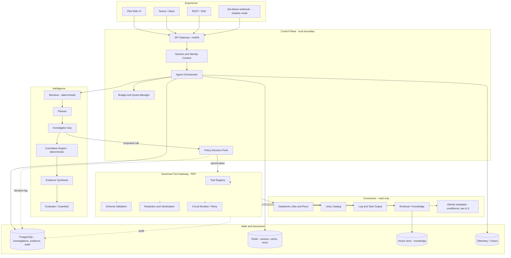

# NEXUS Solution Design Document (SDD)

> **Product:** NEXUS - AI Data Reliability and Engineering Agent
> **Document type:** Solution Design Document (technical design authority for the 12-week MVP)
> **Version:** 1.0 (Draft for architecture review)
> **Date:** September 7, 2026
> **Status:** Proposed
> **Upstream inputs:** `NEXUS_Business_Proposal_PRD_Architecture_v0.1.pdf`, `NEXUS_Project_Phases_and_Delivery_Plan_v1.0.md`
> **Scope of this document:** MVP (Phases 0-6). Post-MVP phases (7-10) are addressed only as extension seams.

---

## 0. How to read this document

| Upstream document | Answers | This SDD answers |
|---|---|---|
| Business Proposal / PRD | *Why* build it, *what* it must do, *how well* | *How* it is built, *by which component*, *with what contract* |
| Phases and Delivery Plan | *When* each capability lands and *which gate* releases it | *What exists in the codebase* at each gate, and what must be built early even though it is hardened late |

Every design element below carries a **Phase tag** (`[P1]`..`[P6]`) indicating when it is first implemented, and a **Traceability ID** where it satisfies a named PRD requirement or user story.

---

# Part I - Analysis of the Inputs

## 1. What the inputs establish

The proposal and the delivery plan are internally coherent on the important things:

- **The product is an investigator, not an operator.** MVP has no write path. Every architectural decision must make a production write *technically impossible*, not merely *unrequested*.
- **Evidence is the product.** The differentiator is not a summarised error message; it is a traceable chain from conclusion to inspectable artifact. This makes the **evidence model the central data structure**, not the conversation.
- **Governance is a first-class runtime component**, not a compliance wrapper. Policy is evaluated per tool call, before execution.
- **Databricks is Tool #1, not the boundary.** Portability is asserted at three seams: model provider, tool contract, evidence model.
- **Autonomy is gated, not scheduled.** Phases 7-10 exist but are explicitly earned.

These are the correct load-bearing decisions and this design does not relitigate them.

## 2. Tensions and gaps found between the two documents

The following are real inconsistencies or under-specifications that must be resolved in the design rather than discovered during build. Each is carried into a design decision later in this document.

| # | Finding | Where it appears | Design consequence |
|---|---|---|---|
| **A-1** | **Timeline mismatch.** The PDF delivery plan uses five stages (W1-2, W3-5, W6-8, W9-10, W11-12). The Phase plan uses seven phases (W1, W2-3, W4-5, W6-7, W8-9, W10-11, W12). | PDF slide 16 vs. Plan §4.1 | The **7-phase plan is treated as governing** (it is the newer, gated artifact). The PDF's 5-stage view is a summary. Programme reporting must use one, not both. Raise at Gate 0. |
| **A-2** | **Policy enforcement is required from the first tool call, but the policy engine is a Phase 4 deliverable.** The NFR "100% of tool calls policy-checked and audited" applies to Phase 2 evidence collection too. | PDF slide 17 / 22 vs. Plan Phase 4 | The **Policy Decision Point (PDP) interface and audit sink are built in Phase 1** with a static, deny-by-default allowlist. Phase 4 replaces the *implementation* behind a stable interface, not the *call path*. See §8. |
| **A-3** | **Code-change correlation is a Phase 3 reasoning capability, but no repository connector is delivered until Phase 7.** | Plan Phase 3 ("Code-change correlation where evidence is available") vs. Phase 7 (GitHub integration) | Either (a) add a **read-only GitHub commit/PR metadata tool in Phase 2**, or (b) descope code correlation from MVP. **Recommendation: (a)**, narrowly scoped to `list_commits` + `get_commit_metadata` on pilot repos only. Decision required at Gate 1. Until resolved, the Investigator must emit code correlation as *missing evidence*, never as inference. |
| **A-4** | **US-07 (event-triggered investigation in shadow mode) is a P1 MVP story, but event-driven triggering is Phase 8.** | PDF slide 21 vs. Plan Phase 8 | Design a **thin trigger adapter in Phase 5** that accepts a job-failure webhook and creates an investigation with `mode=shadow` and `visibility=internal`. This is ~2 days of work and satisfies US-07 without pulling Phase 8's deduplication, severity routing, and DLQ machinery into MVP. |
| **A-5** | **Vector search appears in the Phase 1 state layer of the reference architecture, but knowledge retrieval is a Phase 3 capability.** | PDF slide 11 vs. Plan Phase 3 | Provision the store in Phase 1 (infrastructure), populate and query it in Phase 3. Avoids a late infrastructure request. Do **not** build ingestion in Phase 1. |
| **A-6** | **Latency targets are inconsistent in kind.** "Initial acknowledgement <= 2s" and "useful diagnosis <= 5 min" cannot both be met by a synchronous request. | PDF slide 22 | The investigation API **must be asynchronous** (202 + resource + poll/stream). This is a hard architectural consequence and is reflected in §7. |
| **A-7** | **"Confidence 0.92" is shown in the product mock.** A numeric confidence implies a calibration method that no phase delivers. | PDF slide 7 | Use **banded confidence** (High / Medium / Low) with published, evidence-count-based criteria. A false-precision decimal actively harms the trust goal. See §9.4. |
| **A-8** | **Tool output is untrusted input, but no phase names prompt-injection defence before Phase 4** - while Phase 3 ingests runbooks and logs, the two highest-risk sources. | Plan Phase 3 vs. Phase 4 | **Content quarantine is a Phase 3 deliverable**, not Phase 4. Phase 4 adds adversarial testing and formal review. See §10.5. |
| **A-9** | **Retention is listed as an open decision (D-07) but Phase 2 begins persisting raw tool payloads.** | PDF slide 23 vs. Plan Phase 2 | Phase 2 must ship with a **default retention of 30 days on raw payloads and a working purge job**, overridable. Building persistence without a delete path is the classic irreversible mistake. |
| **A-10** | **No explicit multi-tenancy model** despite "tenant" appearing in the normalized request and "cross-team isolation tests" in Phase 4. | PDF slide 15 vs. Plan Phase 4 | Tenant is a **mandatory partition key on every persisted row from Phase 1**. Retrofitting tenancy after data exists is expensive. See §6.1. |

## 3. Design risks that follow from the analysis

| Risk | Why it matters here | Mitigation in this design |
|---|---|---|
| Evidence layer becomes a thin passthrough of Databricks JSON | Portability claim collapses; Phase 10 becomes a rewrite | Normalized `Evidence` envelope is mandatory at the gateway boundary (§6.3); connectors may never return raw provider objects upward |
| Policy becomes advisory logging | "100% policy-checked" is met on paper, unenforced in practice | PDP returns `DENY` by default; the gateway has no code path that executes a tool without a `PERMIT` decision token (§8.3) |
| The agent loop becomes unbounded | Cost and latency drift; Gate 6 economics fail | Hard budgets per investigation: steps, tool calls, tokens, wall-clock (§9.6) |
| Diagnosis quality is asserted anecdotally | Gate 3 has no defensible evidence | Golden-set evaluation harness is a Phase 3 *deliverable*, built before the reasoning it grades (§13.3) |

---

# Part II - Solution Design

## 4. Design principles (binding)

1. **Read-only by construction.** No write-capable credential is issued to the MVP runtime. Enforcement is layered: credential scope → tool contract `risk_class` → gateway method allowlist → PDP decision. Any one layer failing must not produce a write.
2. **No conclusion without a citation.** The synthesis stage rejects any claim not bound to an `evidence_id`. Unbound claims are downgraded to hypotheses or dropped.
3. **The model never sees unfiltered tool output.** All tool output passes normalization, redaction, size-capping, and untrusted-content wrapping before entering context.
4. **Every boundary is a versioned contract.** API, tool contract, evidence envelope, model adapter, and prompt are independently versioned.
5. **Determinism where possible.** Resolution, comparison, and diffing are code, not prompts. The model is used for classification, correlation, and explanation - not for arithmetic or lookup.
6. **Fail visible, not silent.** A missing tool result becomes an explicit *missing evidence* entry in the output, never an unstated omission.
7. **Tenant and identity are carried end to end.** No component reads data without a subject and a purpose.

---

## 5. Logical architecture



### 5.1 Trust boundary

Everything inside the Control Plane, Intelligence, and Tool Gateway runs under NEXUS's control. **Connectors are outside the trust boundary for data** (their output is untrusted) and inside it for credentials. The model provider is outside the trust boundary entirely: nothing enters a prompt that has not passed redaction.

### 5.2 Deployment shape (MVP)

Single deployable service (`nexus-api`) hosting orchestrator, intelligence, and gateway in-process, plus one worker pool for investigation execution. This is deliberate: multi-service decomposition before load characteristics are known adds operational cost without benefit. The **module boundaries are drawn as if they were services** (no shared mutable state, contract-typed calls) so extraction in Phase 8-10 is mechanical.

---

## 6. Data design

### 6.1 Core entities

All tables carry `tenant_id` (mandatory, indexed, first column of every composite index) and `created_at`. Addresses **A-10**.

```
investigation
  id                 uuid pk
  tenant_id          text not null
  subject_id         text not null           -- invoking user
  origin             enum(user, event, api)
  mode               enum(interactive, shadow)
  status             enum(queued, planning, investigating, synthesizing, complete, failed, aborted, needs_input)
  question_text      text
  resolved_target    jsonb                   -- job_id, run_id, workspace, pipeline
  plan_version       text
  prompt_version     text
  policy_version     text
  budget             jsonb                   -- steps, tokens, wall_clock_ms, tool_calls
  consumed           jsonb
  outcome_id         uuid  -> diagnosis
  correlation_id     text not null
  created_at, updated_at, completed_at
```

```
evidence
  id                 uuid pk
  tenant_id          text not null
  investigation_id   uuid fk
  source_system      text        -- databricks | unity_catalog | knowledge | github
  source_resource_id text        -- fully-qualified resource URI
  evidence_type      text        -- run_status | task_error | job_config | schema | lineage | log_excerpt | runbook | commit
  collected_at       timestamptz not null
  event_at           timestamptz null
  freshness          enum(live, cached, stale, unknown)
  sensitivity        enum(public, internal, confidential, restricted)
  authz_context      jsonb       -- subject, permission used, decision id
  content_ref        text        -- pointer to payload store
  content_summary    text        -- normalized, redacted, model-visible
  citation_key       text        -- stable, user-facing e.g. EV-07
  integrity          enum(validated, unvalidated, truncated, partial)
  redaction_applied  jsonb
  retention_class    text
  expires_at         timestamptz -- addresses A-9
```

```
trace_step                      diagnosis                        feedback
  id, investigation_id            id, investigation_id             id, investigation_id
  seq, step_type                  summary                          rating
  tool_name, input_hash           timeline jsonb                   correct boolean
  policy_decision_id              hypotheses jsonb  -- ranked       actual_root_cause text
  latency_ms, tokens_in/out       confidence_band                  corrected_by
  outcome, error_class            recommended_action jsonb         created_at
  started_at, ended_at            missing_evidence jsonb
                                  citations text[]  -- evidence ids
```

```
audit_record          -- append-only, no UPDATE/DELETE grant on the role
  id, tenant_id, investigation_id, subject_id, occurred_at
  action              -- tool.invoke | policy.decide | data.access | model.call | export
  resource, purpose, policy_id, decision, reason
  result_status, redaction_applied, request_hash
```

### 6.2 The three memories (per PDF slide 14)

| Store | Contains | Mutability | Retention default |
|---|---|---|---|
| **Operational facts** (PostgreSQL) | incident, job/run/task, error, schema, lineage, change refs | Derived; re-fetchable | 90 days |
| **Agent trace** (PostgreSQL, append-only) | request, plan, tool call, observation, hypothesis | Immutable | 1 year (audit-driven) |
| **Knowledge memory** (Vector + metadata) | runbooks, past incidents, resolution patterns | Versioned, re-indexable | Until source is withdrawn |
| Raw tool payloads (object store) | Unnormalized responses | Immutable | **30 days, purge job shipped in Phase 2** |

Retrieval from Knowledge memory is **filtered before ranking**, never after: the ACL/tenant filter is a pre-filter on the vector query, not a post-filter on results. Post-filtering leaks existence.

### 6.3 The Evidence envelope is the portability seam

Connectors return `Evidence[]`, never provider-native objects. A Databricks task failure and (in Phase 10) an Airflow task failure both normalize to `evidence_type = task_error` with the same envelope. **Rule: no code above the Tool Gateway may reference a provider-specific field name.** This is enforced by a lint rule and a contract test in Phase 2.

---

## 7. API design `[P1]`

Asynchronous by construction (addresses **A-6**).

| Method | Path | Purpose | Response |
|---|---|---|---|
| `POST` | `/v1/investigations` | Create an investigation | `202` + `{id, status, links}` within **2s** |
| `GET` | `/v1/investigations/{id}` | Status + partial results | `200` |
| `GET` | `/v1/investigations/{id}/events` | SSE stream of step transitions | `200 text/event-stream` |
| `GET` | `/v1/investigations/{id}/evidence` | Evidence list with citations | `200` |
| `GET` | `/v1/evidence/{id}` | Single evidence item + source link | `200` |
| `POST` | `/v1/investigations/{id}/feedback` | Correctness + actual resolution | `201` |
| `POST` | `/v1/investigations/{id}/abort` | Operator stop | `202` |
| `GET` | `/v1/investigations/{id}/audit` | Exportable audit trail (US-08) | `200` |
| `GET` | `/healthz`, `/readyz` | Liveness / readiness | `200` |

**Request (normalized, per PDF slide 15):**

```json
{
  "subject": {"user_id": "...", "roles": ["data_engineer"]},
  "tenant": "pilot-domain-a",
  "intent": "diagnose_job_failure",
  "resource_refs": [{"type": "databricks_job", "id": "1234", "workspace": "..."}],
  "question": "Why did customer_daily_ingestion fail?",
  "constraints": {"max_wall_clock_ms": 300000, "sensitivity_ceiling": "confidential"},
  "correlation_id": "..."
}
```

**Error contract:** every error returns `{error_code, message, retryable, correlation_id, partial_results_available}`. `error_code` is drawn from a closed taxonomy (§11.2) - never a free-text string.

**Auth:** OIDC/OAuth2 bearer. Token carries subject, tenant, roles. `[P1]` accepts a dev issuer; `[P4]` binds to the enterprise IdP. The *claims contract* does not change between the two - only the issuer.

---

## 8. Governance design

### 8.1 Four independent controls (per PDF slide 13)

| Control | Question it answers | Where enforced |
|---|---|---|
| Identity | Who is asking, on whose behalf? | API gateway + session context |
| Data scope | What data may this subject see? | Connector-level authz + catalog permissions + redaction |
| Tool scope | Which verbs, with which parameters, at what rate? | Tool registry + PDP |
| Action gate | Does this require approval? | PDP (`APPROVAL_REQUIRED`) - **always `DENY` for writes in MVP** |

These are deliberately not collapsed into one check. A subject authorized to *use* a tool may still be unauthorized for the *resource* that tool addresses.

### 8.2 Policy model

```
decision = PDP.evaluate({
  subject:     {user_id, roles, tenant},
  action:      {tool_name, verb, risk_class},
  resource:    {system, resource_id, sensitivity, environment},
  purpose:     investigation.intent,
  context:     {investigation_id, step_seq, budget_remaining, mode}
})
-> {effect: PERMIT | DENY | APPROVAL_REQUIRED, decision_id, policy_id, reason, obligations[]}
```

`obligations` carry post-conditions the gateway must apply: `redact:pii`, `truncate:64kb`, `label:stale`.

**MVP policy set (illustrative, versioned as data not code):**

- `deny_all_writes`: any tool with `risk_class != read` → `DENY`. Unconditional. Cannot be overridden by role.
- `env_restriction`: `resource.environment == production` and `verb != read` → `DENY`.
- `tool_allowlist`: tool must be in the tenant's registered allowlist → else `DENY`.
- `resource_scope`: `resource_id` must match the pilot pipeline inventory glob → else `DENY`.
- `sensitivity_ceiling`: `resource.sensitivity > request.sensitivity_ceiling` → `DENY`.
- `rate_limit`: per-subject and per-investigation tool-call ceilings → `DENY` with `retryable=false`.
- Default: `DENY`.

### 8.3 Enforcement invariant (addresses A-2)

> The Tool Gateway exposes exactly one entry point, and that entry point requires a `decision_id` with `effect=PERMIT` issued within the current investigation for the exact `(tool, resource, subject)` tuple. There is no bypass path, no admin flag, and no test hook in the production build.

This interface exists from **Phase 1** with a static allowlist implementation. Phase 4 swaps in the full engine. The call path never changes, so "100% of tool calls policy-checked" is true from the first Databricks call in Phase 2, not from Week 9.

### 8.4 Kill switch `[P4, interface P1]`

Two levels: (a) per-tenant disable, (b) global disable. Both are configuration reads checked at investigation start **and** before each tool call, with a max 30s propagation. A disabled system fails investigations with `SERVICE_DISABLED`, never silently degrades.

---

## 9. Agent intelligence design

### 9.1 Pipeline

```
Resolve (deterministic) -> Plan -> Investigate (bounded loop) -> Correlate (deterministic)
   -> Synthesize -> Evaluate (guardrail) -> Persist
```

### 9.2 Resolver `[P2]` - deterministic, no model

Maps a natural-language question or event to `{workspace, job_id, run_id, task}`. Strategy order: explicit ID → exact name match → fuzzy name match over the authorized job inventory → **escalate to user with candidate list**. Ambiguity is never resolved by the model guessing. Returns `needs_input` status if confidence is insufficient. (Plan Phase 3: "Escalation to the user when required identifiers are absent.")

### 9.3 Planner and Investigator `[P3]`

The Planner emits a typed plan, not prose:

```json
{"steps": [
  {"id": "s1", "tool": "databricks.get_run", "why": "establish failed run and task", "depends_on": []},
  {"id": "s2", "tool": "databricks.get_task_output", "depends_on": ["s1"]},
  {"id": "s3", "tool": "databricks.compare_runs", "depends_on": ["s1"]},
  {"id": "s4", "tool": "catalog.get_schema_history", "depends_on": ["s1"]}
]}
```

Independent steps execute **in parallel** (bounded fan-out, default 4) - required to meet the 5-minute target. The Investigator may replan at most `N=2` times; each replan must cite what new observation justified it.

**Stop conditions (all hard):**
1. Sufficient evidence for a ranked hypothesis with citations.
2. Budget exhausted (steps / tokens / wall-clock / tool calls).
3. Two consecutive steps yield no new evidence.
4. Required identifier missing → `needs_input`.
5. Policy denial on a step the plan declared essential → stop and report the denial explicitly (never route around it).

### 9.4 Correlation and confidence (addresses A-7)

Correlation is **deterministic code**, not a prompt: run-diffing, schema-version diffing, config diffing, volume-delta computation, and timeline merge are implemented as functions over the evidence set. The model classifies and explains; it does not compute.

Confidence is a **published band**, not a decimal:

| Band | Criteria |
|---|---|
| **High** | Direct causal artifact present (e.g. explicit schema-mismatch exception) **and** corroborated by an independent evidence type **and** a matching known-failure pattern or successful-run diff |
| **Medium** | Causal artifact present but uncorroborated, **or** strong correlation without a direct error signal |
| **Low** | Pattern match or inference only; no direct artifact |
| **Abstain** | No hypothesis meets Low. Output states what is missing and what to collect next. |

Abstention is a **success path**, and it is measured in the evaluation set. A system that never abstains is not calibrated.

### 9.5 Output contract `[P3]`

Fixed sections (per Plan §Phase 3), each machine-checkable:

`incident_summary` · `target` · `observed_failure` · `timeline[]` · `evidence[]` · `likely_root_cause` · `alternatives[]` · `confidence_band` · `recommended_action` · `risk_and_escalation` · `missing_evidence[]`

**Guardrail (Evaluator) `[P3]`** runs before persistence and rejects/downgrades output that:
- contains a factual claim with no `evidence_id`,
- cites an `evidence_id` not in this investigation,
- states a root cause while `confidence_band = Abstain`,
- proposes an action outside the read-only MVP boundary,
- contains content matching redaction patterns.

Rejection re-runs synthesis once, then degrades to an evidence-only report. It never publishes an unbound claim.

### 9.6 Budgets (default, tunable per tenant)

| Budget | MVP default |
|---|---|
| Wall clock | 300s (hard), 120s (target p50) |
| Tool calls | 25 |
| Plan steps | 15 |
| Replans | 2 |
| Model tokens | 150k in / 20k out |
| Parallel tool fan-out | 4 |
| Per-tool timeout | 20s (30s for log retrieval) |

Budget exhaustion produces a **partial result with an explicit reason**, not a failure.

### 9.7 Prompt and model management `[P1]`

- Prompts are versioned files, not string literals; `prompt_version` is recorded on every investigation.
- Model access is behind `ModelAdapter` (`complete`, `complete_structured`, `embed`). No provider SDK type crosses this interface.
- Model routing by task class: classification/extraction → small model; synthesis → frontier model. Routing is configuration, evaluated for quality regression in the harness.

---

## 10. Security design

### 10.1 Identity propagation `[P4, interface P1]`

Preferred model: **user delegation** (agent acts with the invoking user's effective permissions on Databricks/Unity Catalog) with a scoped service identity only for resources the user provably cannot hold (e.g. the runbook index). This resolves open decision **D-03** in favour of least surprise: the agent can never show a user something they could not have retrieved themselves.

Where delegation is technically unavailable, the service identity's read scope must be **narrower than the union of pilot users' scopes**, and every access is authorization-checked against the user before the result is returned.

### 10.2 Secrets

Runtime holds no long-lived provider credentials in configuration. Secrets are fetched from the secret manager at startup and on rotation, held in memory only, and never logged, never serialized into trace steps, never placed in prompts. A pre-commit secret scanner plus a runtime egress-redaction filter on model input are both required.

### 10.3 Redaction

Two-stage: **structural** (drop known-sensitive fields by connector-specific rules) then **pattern** (PII/secret regex + entropy heuristics on free text such as log lines). Redaction happens at the gateway, before persistence and before the model. `redaction_applied` is recorded on the evidence row so an auditor can see that redaction occurred without seeing the content.

### 10.4 Data minimization for prompts

Log excerpts are truncated, deduplicated, and windowed around the failure timestamp before entering context. Never send whole log files. This is simultaneously a security control, a cost control, and a quality control.

### 10.5 Prompt injection and untrusted content (addresses A-8) `[P3]`

Logs, task output, runbooks, and ticket text are **attacker-influenceable**. Controls:

1. **Structural quarantine.** Untrusted content enters the prompt only inside a delimited, labelled block with a standing instruction that content within is data, never instruction.
2. **No tool selection from content.** The Planner selects tools from the registry only; a tool name appearing in tool output can never cause invocation.
3. **Capability floor.** Even a fully-compromised model cannot exceed its policy grants - injection can at worst waste budget or produce a wrong (but citation-bound) claim, because writes are structurally absent.
4. **Output scanning.** Evaluator rejects output containing instruction-like directives or URLs not present in cited evidence.
5. **Adversarial corpus** in the evaluation set from Phase 3; formal red-team in Phase 4.

### 10.6 Isolation

Tenant is a partition key, enforced in a repository layer that has no un-tenanted query method. Cross-tenant tests are part of CI, not just Phase 4 security testing.

---

## 11. Resilience and error design

### 11.1 Partial failure is the normal case

A single failed tool must not fail the investigation (PRD: Resilience). Each step result is `ok | denied | timeout | unavailable | empty | truncated`. Non-`ok` results become **first-class missing-evidence entries** carried into the output. The Evaluator verifies that every non-`ok` step is represented in `missing_evidence[]`.

### 11.2 Error taxonomy (closed set)

`AUTH_FAILED` · `AUTHZ_DENIED` · `POLICY_DENIED` · `RESOURCE_NOT_FOUND` · `AMBIGUOUS_TARGET` · `UPSTREAM_TIMEOUT` · `UPSTREAM_UNAVAILABLE` · `UPSTREAM_RATE_LIMITED` · `SCHEMA_VALIDATION_FAILED` · `OUTPUT_TOO_LARGE` · `MODEL_UNAVAILABLE` · `MODEL_OUTPUT_INVALID` · `BUDGET_EXHAUSTED` · `SERVICE_DISABLED` · `INTERNAL_ERROR`

Every error carries `retryable` and a user-facing remediation hint. Error class is a dimension on all failure metrics.

### 11.3 Retry, timeout, circuit breaking

Per-connector: exponential backoff with jitter, max 2 retries, **idempotent reads only** (trivially satisfied in MVP). Circuit breaker opens after 5 consecutive failures per connector; open circuit yields `UPSTREAM_UNAVAILABLE` immediately rather than consuming budget. Model provider gets a secondary route on `MODEL_UNAVAILABLE`; if quality-critical, the investigation degrades to evidence-only rather than silently using a weaker model for synthesis.

### 11.4 Recovery

Investigations are resumable from the trace: state transitions are persisted before side effects, and worker crash mid-investigation results in `failed` with partial evidence retained and a replay handle - not a lost record.

---

## 12. Observability and cost `[P1]`

**Trace model:** one trace per investigation; spans for `resolve`, `plan`, each `tool_call` (with `policy.decide` child), each `model_call`, `synthesize`, `evaluate`. `correlation_id` propagates to connector requests where the provider supports it.

**Required metrics** (all dimensioned by tenant, intent, and outcome):

| Domain | Metrics |
|---|---|
| Product | investigations started/completed/abstained, time-to-first-diagnosis (p50/p95), evidence count per investigation, feedback rating, correction rate |
| Quality | citation coverage %, guardrail rejection rate, abstention rate, replan rate |
| Governance | policy decisions by effect, denials by policy_id, audit-write failures (must be zero) |
| Reliability | tool success rate by connector, error class distribution, circuit-breaker state, partial-result rate |
| Cost | tokens in/out per investigation, model spend per investigation, tool call count, cache hit rate, **cost per useful diagnosis** |

`cost_per_useful_diagnosis` (spend ÷ investigations rated useful) is the metric that decides Gate 6 economics; it must exist from Phase 3, not be reconstructed in Week 12.

**Audit integrity:** an audit write failure aborts the operation it describes. An unauditable tool call must not happen.

---

## 13. Test and evaluation strategy

### 13.1 Test pyramid

| Level | Scope | Gate |
|---|---|---|
| Unit | resolvers, diffing, redaction, policy rules, envelope mapping | P1+ |
| Contract | tool contract conformance; connector → `Evidence` mapping; API schema | P2 |
| Integration | full loop against recorded Databricks fixtures + a non-prod workspace | P2 |
| Security | authz matrix, cross-tenant, injection corpus, secret leakage, write-path absence | P4 (authored P2-P3) |
| Evaluation | golden incident set, groundedness, calibration, regression | P3 |
| Load/soak | concurrency, partial failure, provider outage | P6 |

### 13.2 Fixture strategy

Record real (sanitized) Databricks responses into a fixture library in Phase 2. All CI runs against fixtures; a nightly job runs against the non-prod workspace to detect provider drift. This keeps CI deterministic and fast while catching API changes.

### 13.3 Evaluation harness `[P3]` - built before the reasoning it grades

**Golden set:** 30-50 historical incidents from the pilot pipelines, each labelled with root cause, the evidence a competent engineer would require, and an acceptable-recommendation set. Labelled by pilot engineers (resolves **D-05**; must be scheduled in Phase 0, not Phase 3 - the labelling is the long pole).

**Scored dimensions:**

| Dimension | Definition | Proposed gate for Gate 3 |
|---|---|---|
| Root-cause accuracy | Correct cause in top-1 / top-3 | ≥60% top-1, ≥80% top-3 |
| Groundedness | Material claims with valid citations | ≥90% (PRD target) |
| Hallucination rate | Claims contradicted by evidence | 0 tolerated in critical class |
| Calibration | High-confidence precision | ≥85% |
| Appropriate abstention | Abstains on under-evidenced cases | ≥70% of the designed-insufficient subset |
| Consistency | Same incident, 3 runs, same top hypothesis | ≥80% |
| Latency / cost | p95 wall clock, spend per investigation | ≤300s, budget TBD at Gate 0 |

Thresholds are **proposals for Gate 0 ratification**; they are not derivable from the current documents and should not be set by the build team alone.

### 13.4 Shadow mode `[P5]`

Event-triggered investigations (A-4) run with results visible only to the product team. Shadow results are scored against what engineers actually concluded - the cheapest source of real evaluation data before Gate 5.

---

## 14. Environments, deployment, and operations

| Environment | Purpose | Data | Access |
|---|---|---|---|
| `local` | Development | Fixtures + mock tools | Developer |
| `dev` | CI target | Fixtures + non-prod Databricks | Team |
| `staging` | Pre-pilot validation | Non-prod Databricks; sanitized knowledge | Team + security |
| `pilot` | Controlled pilot | **Read-only** production Databricks; real runbooks | Pilot users only |

`pilot` reads production data. This is the point of the product and it is why the write-path absence, redaction, and audit controls are gating rather than advisory.

**Pipeline:** commit → lint/type → unit → contract → security scan (SAST, secrets, deps) → build image → deploy `dev` → integration → deploy `staging` → evaluation suite → manual gate → `pilot`. **The evaluation suite is a deploy gate, not a report.** A prompt change that regresses groundedness cannot reach pilot.

**Rollback:** image rollback plus independent rollback of prompt version and policy version (they change at different cadences than code). Rehearsed in Phase 6.

**SLOs (proposed, Gate 6):** availability 99.5% pilot hours; p95 time-to-first-diagnosis ≤300s; investigation success (non-`INTERNAL_ERROR`) ≥98%; audit completeness 100%.

---

## 15. Phase-to-design mapping

What exists in the codebase at each gate. Items marked **early** are built ahead of their hardening phase for the reasons given in Part I.

| Phase | Design elements delivered | Early items (and why) |
|---|---|---|
| **P0** | Golden-set labelling schedule; pilot resource inventory; decision closure D-01..D-08 | Evaluation labelling starts now (long pole, §13.3) |
| **P1** | API (§7), orchestrator, ModelAdapter, tool registry, mock tools, PostgreSQL schema **with tenant partitioning**, Redis, PDP **interface + static allowlist**, audit sink, trace/metrics, CI/CD, vector store provisioned | PDP interface (A-2), tenancy (A-10), vector store (A-5) |
| **P2** | Databricks connectors, Evidence envelope + citations, deterministic Resolver, run-comparison, gateway validation/redaction/limits, fixtures, **retention + purge job** | Purge job (A-9); GitHub metadata tool *if* A-3 resolved as (a) |
| **P3** | Planner, Investigator loop, Correlation engine, Synthesis, **Evaluator guardrail**, knowledge ingestion + filtered retrieval, evaluation harness + golden set, **content quarantine** | Injection defence (A-8); harness precedes tuning |
| **P4** | Enterprise IdP, full policy engine behind the P1 interface, delegation model, kill switch, threat model, adversarial + isolation test suites, security review package | - |
| **P5** | Pilot UI, evidence inspection, feedback capture, Teams/Slack notify, Jira linking, **shadow-mode event trigger** | Event trigger (A-4) |
| **P6** | Load/soak, provider-failure drills, cost model, SLOs, production architecture, rollback rehearsal, go/no-go pack | - |

---

## 16. Traceability

| PRD / plan requirement | Design element |
|---|---|
| US-01 Ask about a failed job in natural language | §7 API, §9.2 Resolver |
| US-02 See exact evidence, open source artifact | §6.1 `evidence`, §7 `/evidence/{id}`, §9.5 citations |
| US-03 Ranked hypotheses, confidence, missing context, alternatives | §9.4, §9.5 |
| US-04 Only authorized tools and data | §8.2 PDP, §10.1 delegation, §8.3 invariant |
| US-05 Recommended action, risk, owner, escalation | §9.5 output contract |
| US-06 Feedback and actual resolution | §6.1 `feedback`, §7 `/feedback`, §13.4 |
| US-07 Event-created investigation in shadow mode | §15 P5 trigger adapter (A-4) |
| US-08 Auditor reconstructs full trace | §6.1 `audit_record`, §7 `/audit`, §12 |
| Useful diagnosis ≤5 min | §7 async, §9.3 parallel fan-out, §9.6 budgets |
| Ack ≤2s | §7 `202` |
| ≥90% claims evidence-linked | §9.5 Evaluator, §12 citation coverage |
| 100% tool calls policy-checked and audited | §8.3 invariant, §12 audit integrity |
| 0 unauthorized production writes | §4.1 layered read-only, §8.2 `deny_all_writes` |
| Graceful partial-tool failure | §11.1 |
| Versioned prompts and policies | §9.7, §8.2, §14 rollback |
| Platform independence | §6.3 envelope, §9.7 ModelAdapter, tool contract |

---

## 17. Architecture decisions (ADR index)

| ADR | Decision | Rationale |
|---|---|---|
| ADR-01 | Asynchronous investigation API | Reconciles 2s ack with 5-min diagnosis (A-6) |
| ADR-02 | Single deployable service, service-shaped modules | Avoids premature distribution; keeps Phase 10 extraction mechanical |
| ADR-03 | PDP interface from Phase 1; engine from Phase 4 | Makes "100% policy-checked" true from the first real tool call (A-2) |
| ADR-04 | Normalized Evidence envelope mandatory at the gateway | The portability claim is only real if enforced (§6.3) |
| ADR-05 | Deterministic resolution, diffing, and correlation | Reduces hallucination surface and cost; model explains, does not compute |
| ADR-06 | Banded confidence, not numeric | Avoids unearned precision; supports calibration measurement (A-7) |
| ADR-07 | User delegation as the primary identity model | Agent cannot exceed the user's own reach (D-03) |
| ADR-08 | Evaluation harness precedes reasoning tuning | Gate 3 needs evidence, not demos |
| ADR-09 | Untrusted-content quarantine from Phase 3 | Runbooks and logs are the injection surface (A-8) |
| ADR-10 | Tenant partitioning from Phase 1 | Retrofitting tenancy after data exists is expensive (A-10) |
| ADR-11 | Retention default + purge job ship with first persistence | Never build storage without a delete path (A-9) |

---

## 18. Open decisions carried from the proposal

| ID | Decision | SDD recommendation | Needed by |
|---|---|---|---|
| D-01 | Pilot domain | - (business) | Gate 0 |
| D-02 | Hosting and residency | Co-locate runtime, state, and model endpoint in the pilot's data region; no cross-region trace export | Gate 0 |
| D-03 | Identity model | **User delegation primary**, narrow service identity for shared knowledge only (§10.1) | Gate 1 |
| D-04 | Knowledge scope | Pilot-team runbooks + resolved incidents for pilot pipelines only; explicit owner sign-off per source | Gate 2 |
| D-05 | Evaluation truth set | Pilot engineers label; **start in Phase 0** (§13.3) | Gate 0 |
| D-06 | Model posture | Two approved classes (small/frontier) behind ModelAdapter; no-training data terms mandatory | Gate 1 |
| D-07 | Retention | Raw payloads 30d, operational facts 90d, trace 1y, subject to legal review (§6.2) | Gate 2 |
| D-08 | Scale gate | Thresholds in §13.3 plus zero unresolved critical security findings | Gate 6 |
| **A-1** | Which timeline governs | **7-phase plan governs** | Gate 0 |
| **A-3** | Code correlation in MVP? | Add narrow read-only GitHub metadata tool, or descope | Gate 1 |

---

## 19. What this design deliberately does not do

- No autonomous remediation, PR generation, or job control. No code path exists.
- No multi-agent orchestration or agent-to-agent debate.
- No predictive anomaly detection.
- No replacement of existing monitoring or ITSM.
- No cross-domain access beyond the pilot inventory.
- No self-modifying prompts or policies.

Each is an explicit Phase 7-10 candidate behind a governance gate, not an omission.

---

## 20. Approval

| Role | Name | Decision | Date | Notes |
|---|---|---|---|---|
| Technical architect | | | | |
| Product owner | | | | |
| Security and privacy | | | | |
| Data engineering lead | | | | |
| Platform engineering lead | | | | |
| Applied AI lead | | | | |
