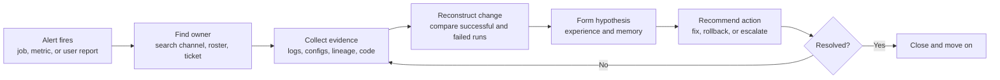

# 05 - Current-State Incident Workflow

> **Status:** Discovery instrument | **Owner:** Product lead + UX | **Due:** Wednesday 9 September 2026
> **Method:** Structured interviews (4-6 pilot engineers) + walkthrough of 3 recent real incidents

---

## 1. Objective

Produce an evidence-based map of how incident investigation actually happens today - not how the runbook says it happens. The map serves three purposes: it locates where NEXUS inserts, it produces the time baseline in [06](06_Baseline_Metrics_Workbook.md), and it identifies the handoffs whose removal is the value hypothesis.

**Bias warning for the facilitator:** the proposal already asserts a six-step model (alert → find owner → collect evidence → reconstruct change → form hypothesis → recommend action). Treat that as a hypothesis to falsify, not a template to confirm. The most useful Phase 0 finding would be that the real bottleneck sits somewhere the proposal does not predict - for example in ownership ambiguity or in waiting for an upstream team, neither of which NEXUS fixes.

## 2. Hypothesised current state (to be validated or corrected)



For each step, capture: who performs it, which tools they open, elapsed time, wait time versus active time, how often it loops, and what makes it slow.

## 3. Interview guide

Run 30-45 minutes per engineer. Record answers verbatim where possible.

**Context**
1. What is your role, and how often are you involved in pipeline incidents?
2. Walk me through the last incident you personally investigated, from notification to resolution.

**Detection and routing**
3. How did you first learn about it? Would anyone else have been notified?
4. How did you know it was yours? Has an incident ever sat unowned - how long?
5. How do you judge severity and whether to drop what you are doing?

**Evidence collection** (the step NEXUS targets most directly)
6. What was the first thing you opened? Then what?
7. How many distinct systems or tabs did you use? Name them.
8. What did you have to ask another person for, and how long did that take?
9. What evidence did you want but could not get?
10. How much of that collection is the same every time regardless of the failure?

**Reasoning**
11. How did you form your first hypothesis? What signal made you confident?
12. Was your first hypothesis right? If not, what corrected it?
13. What did you compare the failed run against, and how?
14. When have you been confidently wrong, and what did that cost?

**Knowledge**
15. Did a runbook exist? Did you use it? Was it current?
16. Had this failure happened before? How did you find that out?
17. Where does resolution knowledge end up - and who can find it later?

**Resolution and handoff**
18. Who fixed it, and was that the same person who diagnosed it?
19. Did it escalate? To whom, and what triggered the escalation?
20. What was recorded afterwards, and by whom?

**Value and trust**
21. If a system handed you a likely root cause with the evidence attached in two minutes, what would you do differently?
22. What would make you *distrust* such an answer?
23. What would you need to see before you would act on it without re-checking manually?

Questions 22 and 23 are the most important in the guide. They define the evidence-presentation requirements for Phase 5 and the abstention behaviour for Phase 3. Do not skip them for time.

`<<FILL: interview notes, 4-6 engineers | Product lead + UX | Wed 9 Sep>>`

## 4. Incident walkthrough template

Complete for three recent real incidents on the selected pipelines. These become candidate golden-set entries (see [11](11_Evaluation_Dataset_Plan.md)).

```
Incident ref:              <<FILL>>
Pipeline / job:            <<FILL>>
Date and time detected:    <<FILL>>
Detection source:          <<FILL: alert / dashboard / downstream complaint / user report>>
Incident category:         <<FILL: IC-nn from document 03>>

Timeline
  Failure occurred:        <<FILL>>
  Detected:                <<FILL>>       -> detection lag
  Owner engaged:           <<FILL>>       -> routing lag
  First evidence opened:   <<FILL>>
  Root cause identified:   <<FILL>>       -> TIME TO DIAGNOSIS
  Fix applied:             <<FILL>>
  Verified resolved:       <<FILL>>       -> TIME TO RESOLUTION

Effort
  People involved:         <<FILL: number and roles>>
  Active engineer-minutes: <<FILL>>
  Wait time:               <<FILL>>
  Escalations:             <<FILL>>

Evidence actually used
  Systems opened:          <<FILL>>
  Artifacts examined:      <<FILL>>
  Evidence wanted but unavailable: <<FILL>>

Diagnosis
  First hypothesis:        <<FILL>>
  Correct?                 <<FILL>>
  Actual root cause:       <<FILL>>
  How it was confirmed:    <<FILL>>

Counterfactual
  Which steps could NEXUS have performed?          <<FILL>>
  Estimated time saved if it had:                  <<FILL>>
  Which steps would still have required a human?   <<FILL>>
```

The counterfactual section is the honest core of the value case. An incident where NEXUS saves four minutes of a three-hour incident dominated by waiting for an upstream team should be recorded as exactly that.

## 5. Outputs to produce

| Output | Form | Feeds |
|---|---|---|
| Validated current-state swimlane | Diagram, roles as lanes, with elapsed time per step | Charter, Gate 0 |
| Time distribution by step | Where the minutes actually go | [06](06_Baseline_Metrics_Workbook.md) |
| Handoff and wait inventory | Every point work leaves one person's hands | Value model |
| Tool sprawl inventory | Systems opened per incident | Access requirements, [07](07_Access_Requirements_and_Security_Assessment.md) |
| Evidence-gap list | What engineers want and cannot get | Connector scope, RAID |
| Trust requirements | What must be visible for an engineer to act | Phase 5 UX, Phase 3 output contract |
| Target-state overlay | Same swimlane with NEXUS inserted | Charter, Gate 0 |

## 6. Target-state hypothesis

To be drawn after the current state is validated. The expected insertion is that steps 3-5 (collect evidence, reconstruct change, form hypothesis) compress into a single automated stage, leaving detection, ownership, decision, and execution with humans.

**State plainly in the Gate 0 pack which steps NEXUS does *not* touch**, and what proportion of current elapsed time those steps represent. If the untouched steps dominate the timeline, the 50% median-triage-time reduction target is not achievable regardless of how well the agent performs, and the target must be renegotiated at Gate 0 rather than missed at Gate 6.
